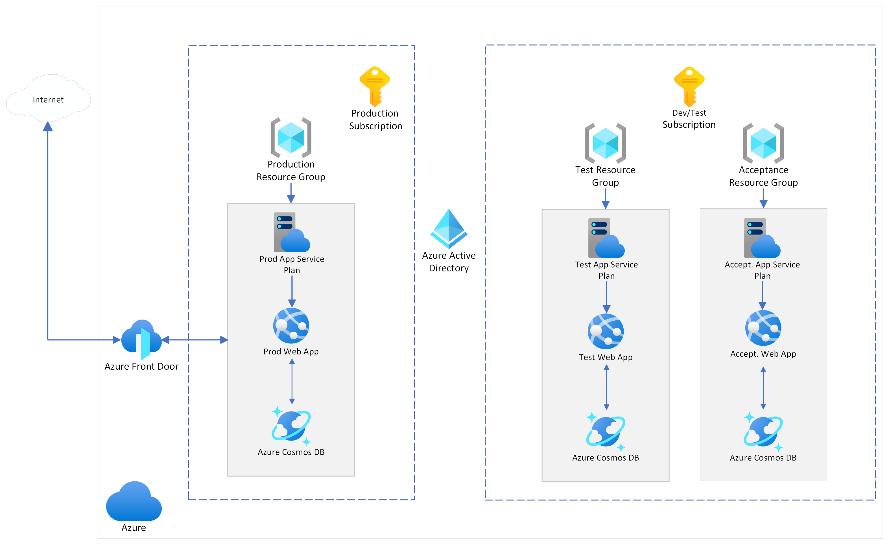

# cloudMigrationDemo

## Commands to run

### make sure terraform CLI is installed

`terraform`

### Navigate into the directory containing environment you would like to run

`cd <directory_name>`

### initialize terraform in this repo

terraform init

### create a new workspace if you are running a non-production environment

`terraform workspace new dev`

### plan and save the infra changes into tfplan file

`terraform plan -out tfplan`

### apply the infra changes

`terraform apply tfplan`

### delete the infra

`terraform destroy`
